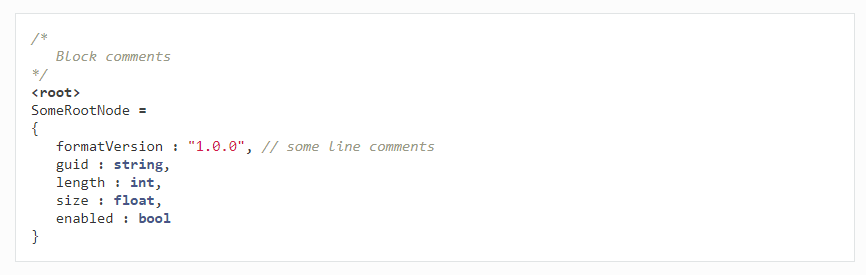

Syntax Highlight in Sphinx
==========================

Sphinx is a great too to write documents. Inlined JsonScript code can be highlighted with the following plugin.

Prerequisite
------------

* Python version 2.7.x (https://www.python.org/downloads/)
* Pygments(Python syntax highlighter)

Installation
------------

*  Copy ``jsonscript.py`` into the ``lexers`` directory of the installed Python package: ``pygments``,
   for example: ``C:\Python27\Lib\site-packages\pygments\lexers`` or ``/usr/lib/python2.7/dist-packages/pygments/lexers``
*  Run ``_mapping.py`` in the ``lexers`` directory to update lexer mapping.

Simple Test
-----------

Run ``pygmentize -O full=True -o sample.html sample.jss`` in the command line, then open ``sample.html`` with your web browser.

Use in Sphinx
-------------

Specify highlighting language in code block directive, ``jss`` or ``JsonScript`` for JsonScript.

Sample::

   .. code-block:: jss

      /*
         Block comments
      */
      <root>
      SomeRootNode = 
      {
         formatVersion : "1.0.0", // some line comments
         guid : string,
         length : int,
         size : float,
         enabled : bool
      }

The above text will be rendered as:

Reference:

* http://pygments.org/
* http://pygments.org/docs/lexerdevelopment/

